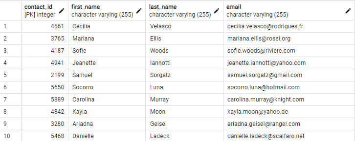
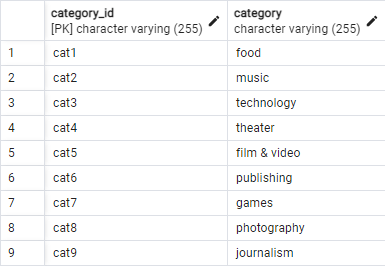
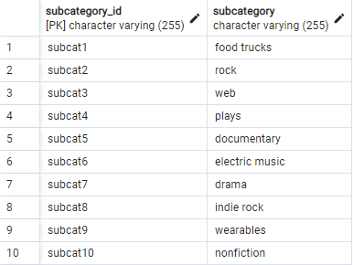
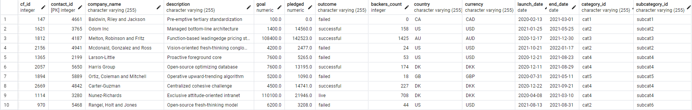

# Crowdfunding_ETL
Project 2
_____________________________________________________________

### PROJECT OVERVIEW:

We have built a crowdfunding ETL pipline by importing 2 .csv files, transforming the data, creating 4 new DataFrames, and exporting those DataFrames into 4 .csv files. Please see .ipynb file for this section.  We also created an ERD to map the relationships between the 4 new tables.  This can be found in the QuickDBD .png file.  We then created 4 empty tables in the SQL crowdfunding_db database that matched our .csv files and imported them into the SQL database.  The table schema can be found in the .sql file, and screenshots of the SQL tables can either be found in the "Output" folder, or seen below.
_____________________________________________________________

### TEAM MEMBERS: 
- Leah Latham
- Murtatha Alwan
- Qonesha Hunter

_____________________________________________________________

### INCLUDED IN THIS REPOSITORY
- "Output" folder containing the following:
    - "SQL_tables" folder containing 4 .png images of the SQL tables created
    - 4 .csv files exported from the Jupyter Notebook file below (ETL_Mini_Project_Starter_code.ipynb)
- "Resources" folder containing 2 .xlsx files
- .gitignore file
- crowdfunding_db_schema.sql - SQL file containing table schema
- ETL_Mini_Project_Starter_code.ipynb - Jupyter Notebook file containing ETL work
- QuickDBD-ETL_Project.png - showing ERD for tables

_____________________________________________________________

### CREATED SQL TABLES

Shown below is the contacts table created in SQL as described above.

Shown below is the category table created in SQL as described above.

Shown below is the subcategory table created in SQL as described above.

Shown below is the campaign table created in SQL as described above.

_____________________________________________________________

### REFERENCES:

- Converting UTC datetime to local datetime: https://stackoverflow.com/questions/4770297/convert-utc-datetime-string-to-local-datetime by: martineau
- narrowing datetime to only date: https://www.geeksforgeeks.org/how-to-convert-datetime-to-date-in-python/